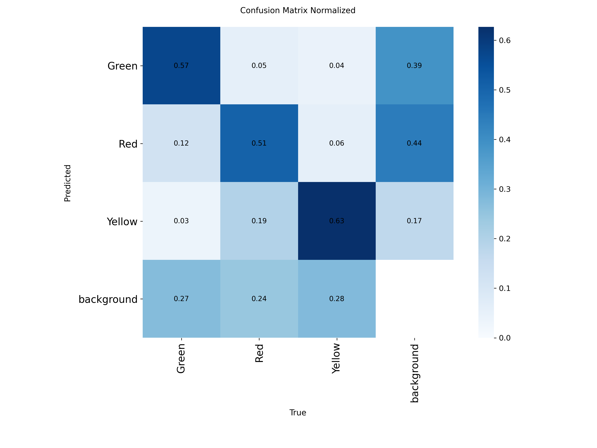
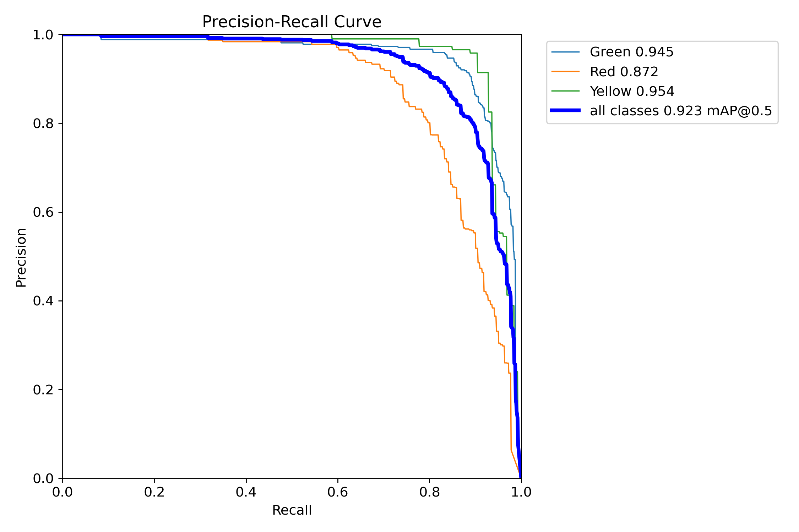
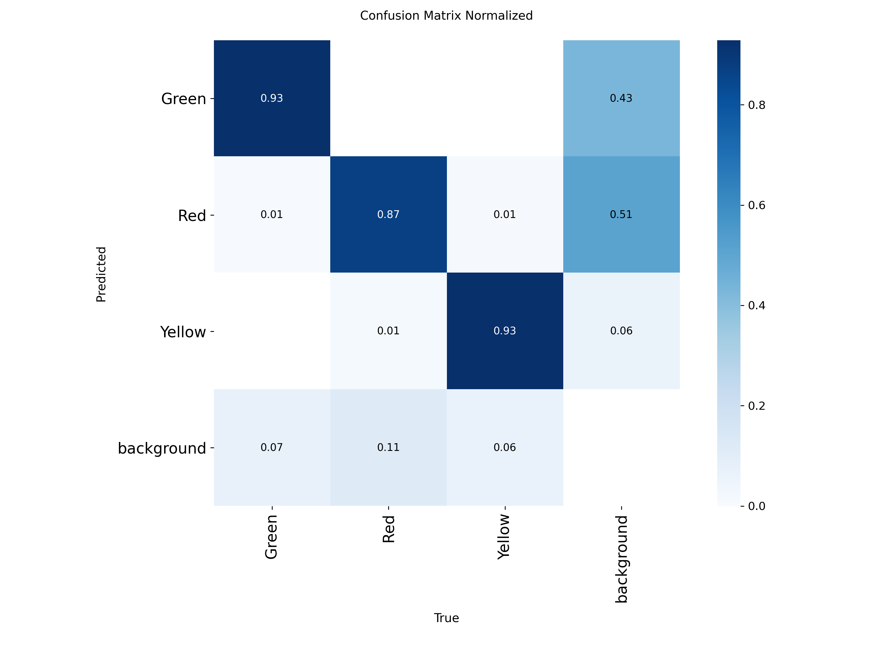
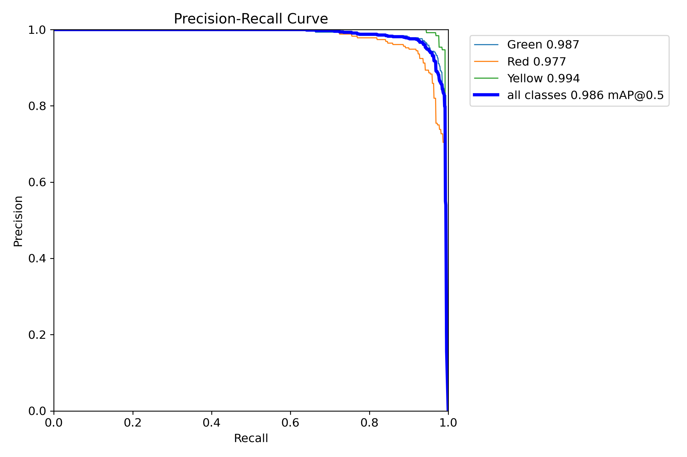
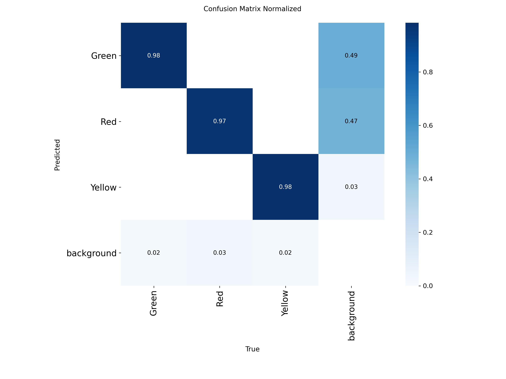

# Resumen Comparativo de Entrenamientos YOLOv8 (1, 10 y 50 Épocas)

| Métrica                   | 1 Época     | 10 Épocas   | 50 Épocas   |
| ------------------------- | ----------- | ----------- | ----------- |
| **mAP@0.5 (global)**      | 0.482       | 0.923       | 0.986       |
| **mAP@0.5–0.95 (global)** | 0.213       | 0.620       | 0.778       |
| **Precision media**       | 0.589       | 0.920       | 0.966       |
| **Recall medio**          | 0.504       | 0.910       | 0.946       |
| **Pico F1 global**        | 0.53 @ 0.60 | 0.87 @ 0.40 | 0.95 @ 0.44 |

---

## 1 Época

- **mAP@0.5**: bajo (0.482).
- **Precision**: 0.589, **Recall**: 0.504.
- **F1 máximo**: ~0.53 a conf=0.60.
- **Conclusión**: sin convergencia; punto de partida muy inicial.

## 10 Épocas

- **mAP@0.5**: se duplica a 0.923.
- **Precision**: 0.920, **Recall**: 0.910.
- **F1 pico**: ~0.87 a conf=0.40.
- **Conclusión**: gran salto de desempeño; modelo ya operativo con buen equilibrio P/R.

## 50 Épocas

- **mAP@0.5**: casi óptimo, 0.986.
- **Precision**: 0.966, **Recall**: 0.946.
- **F1 pico**: ~0.95 a conf=0.44.
- **Conclusión**: madurez en el entrenamiento. Quedan pequeñas confusiones con fondo y la clase _Red_; listo para pruebas en tiempo real y optimización de umbral/NMS.

---

### Conclusiones Generales

1. **Rápida mejora** entre 1 → 10 épocas, y afinamiento fino entre 10 → 50.
2. **Umbral óptimo** de confianza sube ligeramente (0.40 → 0.44) conforme se entrenan más épocas.
3. **Recomendación**: usar el modelo de 50 épocas con conf threshold ≈0.44; ajustar NMS para reducir falsas detecciones de fondo.
4. **Siguientes pasos**: validación en vídeo real, pruebas en hardware embebido y posible recolección de más ejemplos _Red_ para pulir ese tercio.
