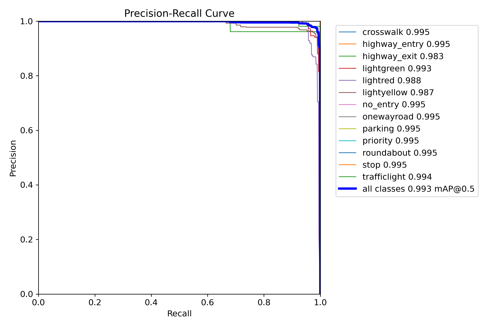

# Resumen Comparativo de Entrenamientos YOLOv8 (1 y 10 Épocas)

En el marco del proyecto de vehículo autónomo a escala (BFMC), entrenamos un modelo **YOLOv8-m** para la detección conjunta de:

- **Luces de semáforo**: `lightgreen`, `lightred`, `lightyellow`
  
- **Señales de tránsito y semáforos**: `crosswalk`, `highway_entry`, `highway_exit`, `no_entry`, `onewayroad`, `parking`, `priority`, `roundabout`, `stop`, `trafficlight`
  

> **Nota**: Para este experimento se realizó una combinación (merge) de dos datasets distintos: uno específico de **semáforos** y otro de **señales de tránsito BFMC**. Posteriormente, todas las imágenes fueron **reescaladas (resize)** y unificadas utilizando la plataforma Roboflow.

| Métrica                   | 1 Época     | 10 Épocas   |
| ------------------------- | ----------- | ----------- |
| **mAP@0.5 (global)**      | 0.995       | 0.995       |
| **mAP@0.5–0.95 (global)** | 0.745       | 0.745       |
| **Precision media**       | 0.981       | 0.991       |
| **Recall medio**          | 0.997       | 1.000       |
| **Pico F1 global**        | 0.93 @ 0.61 | 0.97 @ 0.67 |

---

## 1 Época - [video de prueba con auto bfmc](https://youtu.be/cvspfiX-pog)

- **mAP@0.5**: 0.995
- **Precision**: 0.981, **Recall**: 0.997
- **F1 máximo**: ~0.93 a conf=0.61
- **Conclusión**: el modelo parte con excelente desempeño; ya útil desde la primera época aunque sin estabilidad completa.

## 10 Épocas - [video de prueba con auto bfmc](https://youtu.be/JorXXdNhzco?si=gpK0zj7QkEnCN1ZH)

- **mAP@0.5**: 0.995
- **Precision**: 0.991, **Recall**: 1.000
- **F1 pico**: ~0.97 a conf=0.67
- **Conclusión**: mejora marginal pero importante en consistencia; el modelo gana robustez con más épocas.

---

### Conclusiones Generales

1. **Desempeño alto desde la época 1**, pero las 10 épocas aportan estabilidad y robustez.
2. **El umbral de confianza óptimo mejora** con más entrenamiento, pasando de 0.61 a 0.67.
3. **Recomendación**: usar el modelo de 10 épocas con threshold ≈0.67; comenzar validación en hardware real y ajustar condiciones de inferencia.
4. **Siguientes pasos**: testeo en condiciones reales, validación de latencia y robustez en Raspberry Pi.

---
