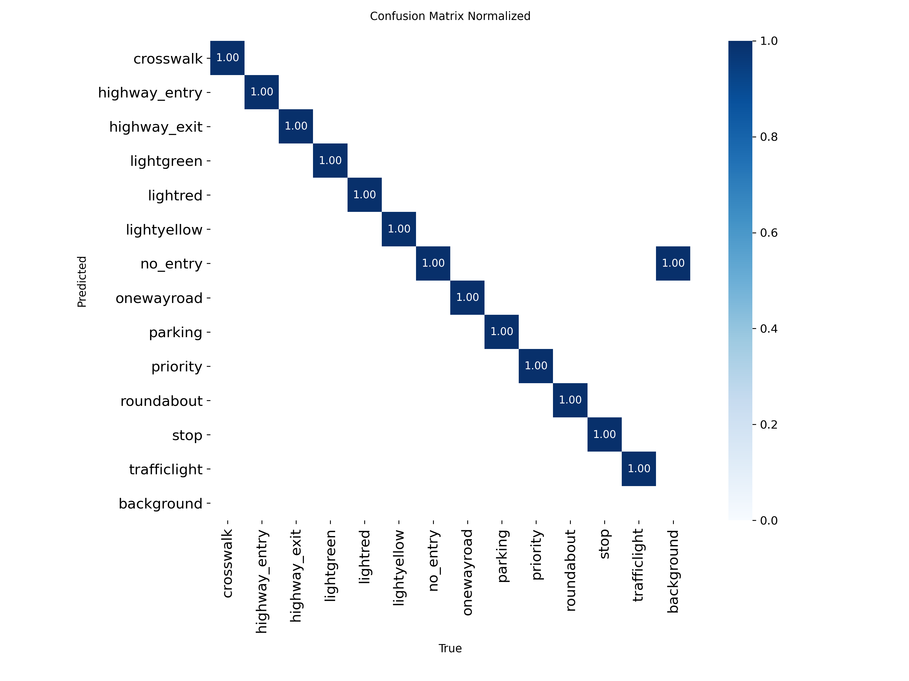
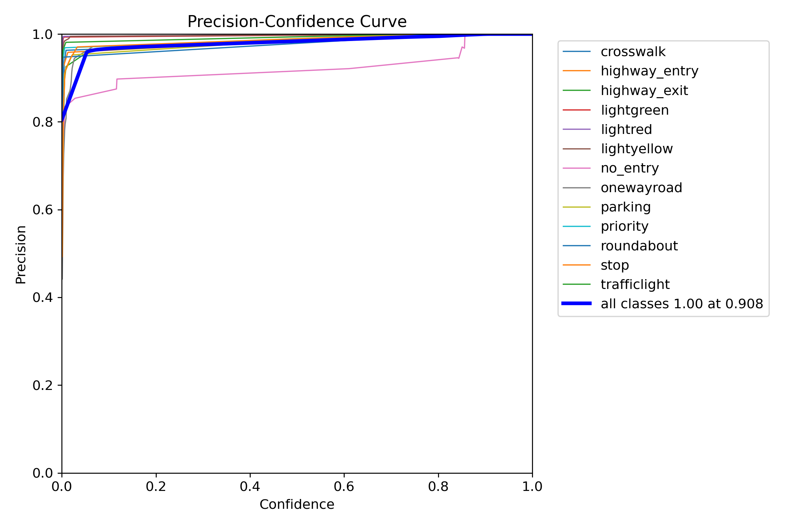
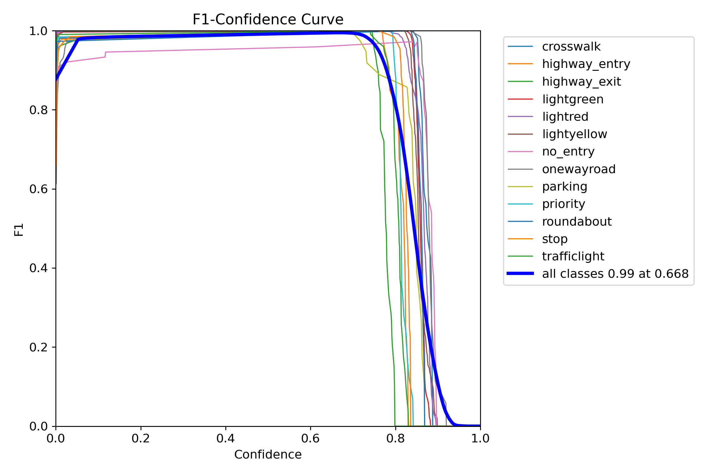

# Informe de Entrenamiento YOLOv8 – Semáforos y Señales de Tránsito con 10 epoch

---

## 1. Introducción

En el marco del proyecto de vehículo autónomo a escala (BFMC), entrenamos un modelo **YOLOv8-m** para la detección conjunta de:

- **Semáforos**: `lightgreen`, `lightred`, `lightyellow`
- **Señales de tránsito**: `crosswalk`, `highway_entry`, `highway_exit`, `no_entry`, `onewayroad`, `parking`, `priority`, `roundabout`, `stop`, `trafficlight`

El objetivo es lograr alta precisión y recall para la toma de decisiones en tiempo real.

---

## 2. Dataset

- **Clases (13)**:

  ```
  crosswalk, highway_entry, highway_exit, lightgreen, lightred,
  lightyellow, no_entry, onewayroad, parking, priority,
  roundabout, stop, trafficlight
  ```

- **Tamaño**

  - _Entrenamiento_: \~ 814 imágenes
  - _Validación_: \~ 822 imágenes

- **Balance**

  - Clases como `light*`, `stop` y `trafficlight` muy representadas
  - Clases como `roundabout` y `parking` menos frecuentes

---

## 3. Configuración de Entrenamiento

- **YOLOv8** v8.3.154 (`yolov8m.pt`, ≈ 25.8 M parámetros)
- **Hardware**: Tesla T4 (Colab)
- **Épocas**: 10
- **Batch size**: 16
- **Imagen**: 640 × 640 px
- **Optimizador**: AdamW (inicial lr≈0.00059, momentum=0.9)
- **Augmentaciones** (p=0.01): Blur, MedianBlur, ToGray, CLAHE
- **Mosaic**: 1.0
- **Sin** mixup / cutmix

---

## 4. Métricas de Validación (época 10)

| Clase         | Precision |  Recall   | mAP\@0.5  | mAP\@0.5–0.95 |
| ------------- | :-------: | :-------: | :-------: | :-----------: |
| crosswalk     |   0.992   |   1.000   |   0.995   |     0.823     |
| highway_entry |   0.994   |   1.000   |   0.995   |     0.656     |
| highway_exit  |   0.996   |   1.000   |   0.995   |     0.668     |
| lightgreen    |   0.999   |   1.000   |   0.995   |     0.775     |
| lightred      |   0.999   |   1.000   |   0.995   |     0.807     |
| lightyellow   |   0.999   |   1.000   |   0.995   |     0.810     |
| no_entry      |   0.927   |   1.000   |   0.990   |     0.771     |
| onewayroad    |   0.994   |   1.000   |   0.995   |     0.728     |
| parking       |   0.998   |   1.000   |   0.995   |     0.723     |
| priority      |   0.995   |   1.000   |   0.995   |     0.725     |
| roundabout    |   0.989   |   1.000   |   0.995   |     0.786     |
| stop          |   0.996   |   1.000   |   0.995   |     0.660     |
| trafficlight  |   0.998   |   1.000   |   0.995   |     0.748     |
| **Global**    | **0.991** | **1.000** | **0.995** |   **0.744**   |

---

## 5. Evolución de Entrenamiento

- **Pérdidas** (train vs. val)

  - `box_loss` ↓ 1.24 → **0.95**
  - `cls_loss` ↓ 2.17 → **0.35**
  - `dfl_loss` ↓ 1.29 → **1.07**

- **Performance global** (época 10):

  - **Precision**: 0.9906
  - **Recall**: 1.000
  - **mAP\@0.5**: 0.9946
  - **mAP\@0.5–0.95**: 0.7441

---

## 6. Análisis y Gráficos

### 6.1. Matriz de Confusión Normalizada

Muestra prácticamente 100 % de acierto en todas las clases.


### 6.2. Curvas Precision–Confidence, Recall–Confidence, F1–Confidence

Todas las clases superan 0.95 de precision y recall a nivel de confianza ≈0.5.




### 6.3. Curva Precision–Recall

Área bajo la curva > 0.95 en todas las clases.


### 6.4. Distribución de Etiquetas

El correlograma confirma buen balance en clases mayores y señala clases poco frecuentes.


---

## 7. Conclusiones y Recomendaciones

1. **Éxito de entrenamiento**

   - Con sólo 10 épocas se logra mAP\@0.5 ≈ 0.995 y recall perfecto.

2. **Robustez**

   - Augmentaciones conservadoras y backbone `yolov8m` son suficientes para alta precisión.

3. **Próximos pasos**

   - Validar en vídeo real y en la Raspberry Pi del prototipo.
   - Realizar pruebas bajo distintas condiciones lumínicas y ángulos.

4. **Mejoras futuras**

   - Probar `mixup`/`cutmix` para incrementar resistencia a oclusiones.
   - Evaluar backbones más grandes (`yolov8l`, `yolov8x`).
   - Ajustar lr_scheduler (cosine, step) para mayor estabilidad.

---
